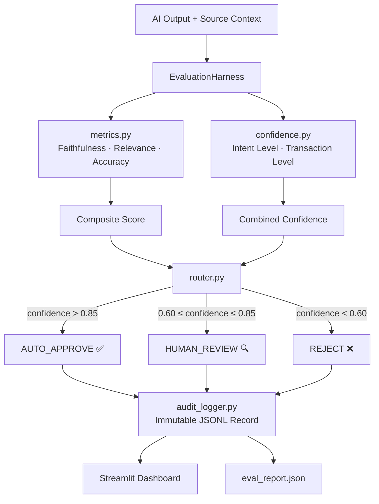

# Mortgage AI Evaluation Harness

> **Production-grade framework for monitoring, scoring, and auditing AI outputs in mortgage pipelines.**
> Zero LLM API calls. Rule-based evaluation engine. CFPB-compliant audit trail.

Built for the Supreme Lending interview — Solution #1: *"Guessing is unacceptable."*

---

## Why this exists

Mortgage AI faces two problems that don't appear in most ML contexts:

| Problem | Consequence |
|---------|------------|
| **Probabilistic outputs in a deterministic domain** | Wrong income extraction = buyback risk, real money lost |
| **Black-box decisions violate ECOA/FCRA** | CFPB requires specific, documented reasons for every credit decision |

This harness wraps any AI output — from an LLM, an OCR model, a classifier — and scores it before it touches a loan file. Low-confidence outputs are never auto-approved; they're held for human review. Every decision is logged in an immutable audit trail.

---

## Architecture



### Module breakdown

| File | Responsibility |
|------|---------------|
| `core/evaluator.py` | Orchestrator — wires all components into `evaluate()` |
| `core/metrics.py` | TF-IDF faithfulness, relevance, field-match accuracy |
| `core/confidence.py` | Two-level confidence: intent fields + plausibility bounds |
| `core/router.py` | Three-way routing with configurable thresholds |
| `core/audit_logger.py` | Immutable append-only JSONL audit trail |
| `mortgage/schemas.py` | Pydantic models for every domain object |
| `mortgage/rules.py` | Simplified TRID/RESPA/ECOA compliance checks |
| `mortgage/sample_data.py` | 10+ realistic synthetic loan applications |
| `mortgage/use_cases.py` | Five end-to-end mortgage scenarios |
| `ui/dashboard.py` | Streamlit real-time metrics dashboard |

---

## Five Use Cases

### UC1 — Income Verification
AI extracts gross income from a W-2 document. Harness checks:
- Extracted value matches borrower-stated income
- Required fields (`gross_income`, `monthly_income`) are present
- Numeric values are plausible

### UC2 — Closing Disclosure Balancing
AI generates a Closing Disclosure. Harness validates:
- All line items sum to the stated closing costs total
- Flags TRID violations (12 CFR 1026.38) when CD is out of balance

### UC3 — Appraisal Comparison
AI compares two competing appraisal reports. Harness checks:
- Appraised value variance exceeds 10% threshold
- Lower/conservative value is used for LTV calculation
- Property address extracted correctly

### UC4 — Credit Decision Explanation
AI generates adverse action reason codes. Harness validates:
- All codes appear in CFPB's approved list (ECOA/FCRA compliant)
- Adverse action notice timing requirement flagged
- Non-compliant codes identified and replacement suggestions generated

### UC5 — Document Version Control
AI identifies the authoritative document version. Harness validates:
- Correct document ID returned (v3 of 3, not v1 or v2)
- Full lineage chain is intact (v1 → v2 → v3)
- Authoritative flag is set on the correct version

---

## Metrics

### Faithfulness
> How grounded is the AI output in the source document it was given?

TF-IDF cosine similarity between AI output text and source context. A hallucinated answer drifts from source vocabulary — this catches it.

### Relevance
> Does the AI output address what was actually asked?

TF-IDF cosine similarity between AI output and the original query.

### Accuracy
> Did the AI extract the right values?

Field-by-field comparison against ground truth. Numerics allow ±1% tolerance (mortgage math rounding). Strings require exact match.

### Composite Score
Weighted average: **faithfulness 40%** · relevance 30% · accuracy 30%.
Faithfulness is weighted highest because hallucinations carry the largest regulatory risk.

### Confidence (two levels)
| Level | What it checks |
|-------|---------------|
| **Intent** | Are all expected fields for this use-case present? |
| **Transaction** | Are numeric values within plausible mortgage bounds? |

Combined confidence drives the routing decision.

---

## Routing Thresholds

| Confidence | Decision | Action |
|------------|----------|--------|
| > **0.85** | `AUTO_APPROVE` | AI output accepted, logged |
| **0.60 – 0.85** | `HUMAN_REVIEW` | Sent to underwriter queue |
| < **0.60** | `REJECT` | Returned with explanation |

Thresholds are configurable:
```python
harness = EvaluationHarness(high_threshold=0.90, low_threshold=0.70)
```

---

## Sample Output (5 use cases)

```
UC1: Income Verification     → AUTO_APPROVE   confidence=1.000  accuracy=1.000
UC2: Closing Disclosure      → HUMAN_REVIEW   confidence=0.833  accuracy=1.000
UC3: Appraisal Comparison    → AUTO_APPROVE   confidence=1.000  accuracy=1.000
UC4: Credit Decision         → AUTO_APPROVE   confidence=1.000  accuracy=1.000
UC5: Document Lineage        → AUTO_APPROVE   confidence=1.000  accuracy=1.000

Summary: 4 AUTO_APPROVE | 1 HUMAN_REVIEW | 0 REJECT
Avg Confidence: 0.967 | Avg Accuracy: 1.000
```

Full output: [`sample_output/eval_report.json`](sample_output/eval_report.json)

---

## Audit Trail

Every evaluation writes an immutable record to `sample_output/eval_report.jsonl`:

```json
{
  "record_id": "uuid-v4",
  "timestamp": "2026-05-16T10:30:00+00:00",
  "use_case": "income_verification",
  "loan_application_id": "LA-001",
  "ai_output_summary": "Income verification complete...",
  "faithfulness_score": 0.2308,
  "relevance_score": 0.2474,
  "accuracy_score": 1.0,
  "composite_score": 0.4665,
  "intent_confidence": 1.0,
  "transaction_confidence": 1.0,
  "combined_confidence": 1.0,
  "routing_decision": "AUTO_APPROVE",
  "routing_reason": "Confidence 1.000 exceeds auto-approve threshold 0.85...",
  "flags": []
}
```

This is the CFPB-defensible piece. If a regulator asks "why did your system approve this?", the record answers exactly that — without relying on any AI to explain itself.

---

## Quick Start

```bash
# 1. Install dependencies
pip install -r requirements.txt

# 2. Run tests (37 tests)
python -m pytest tests/ -v

# 3. Headless report
python app.py --report

# 4. Launch dashboard
streamlit run app.py
```

Or use the convenience scripts:
```bash
# Windows
run.bat

# Mac/Linux
bash run.sh
```

---

## How It Works (without an LLM)

The evaluation engine is intentionally LLM-free. Here's why each component is deterministic:

**Faithfulness** — TF-IDF cosine similarity is computed from term frequencies in the AI output vs. the source document. No model weights, no API calls.

**Relevance** — Same TF-IDF similarity, but between AI output and the task query.

**Accuracy** — Direct field comparison: extracted dict vs. ground truth dict. Numbers get ±1% tolerance; strings get exact match.

**Confidence** — Rule lookup: required fields per use-case (intent), plus bounds checking on numeric values (transaction).

**Routing** — Pure threshold comparison on the combined confidence float.

This makes the harness:
- **Fully reproducible** — same input always gives same output
- **Auditable** — no "the model decided" ambiguity
- **Fast** — sub-second evaluation, 37 tests in 0.19s
- **Portable** — runs on Python 3.10+ with no GPU required

---

## Project Structure

```
mortgage-eval-harness/
├── core/
│   ├── __init__.py
│   ├── evaluator.py      # Main orchestrator
│   ├── metrics.py        # Faithfulness, relevance, accuracy
│   ├── confidence.py     # Two-level confidence scoring
│   ├── router.py         # AUTO_APPROVE / HUMAN_REVIEW / REJECT
│   └── audit_logger.py   # Immutable JSONL audit trail
├── mortgage/
│   ├── __init__.py
│   ├── schemas.py        # Pydantic models
│   ├── sample_data.py    # 10+ synthetic loan applications
│   ├── rules.py          # TRID/RESPA/ECOA compliance checks
│   └── use_cases.py      # 5 end-to-end scenarios
├── ui/
│   └── dashboard.py      # Streamlit dashboard
├── tests/
│   └── test_pipeline.py  # 37 pytest tests
├── sample_output/
│   └── eval_report.json  # Example full run output
├── app.py                # Entry point
├── run.bat / run.sh
├── requirements.txt
├── .env.example
└── .gitignore
```

---

## License

MIT
